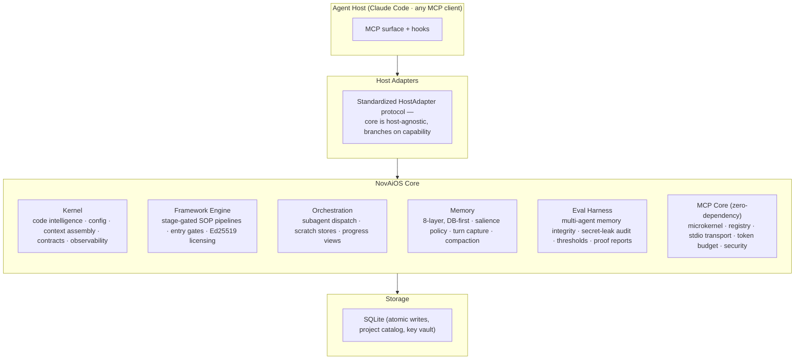

# NovAiOS — Agent Operating System

**A modular operating system for multi-agent software production.**

> 🔒 **Closed-source, commercial system.** This repository is the public architecture tour.
> Live walkthrough & demo: [muratsuer.eu](https://muratsuer.eu) · Contact: murat@muratsuer.eu

---

## What it is

NovAiOS is an operating-system layer for AI coding agents. It sits between the agent host (e.g. Claude Code or any MCP-capable client) and the project, and gives agents what an OS gives processes: **memory, scheduling, permissions, tooling and audit**.

Agents running on NovAiOS plan, build, audit and ship complex software end to end — driven by an agentic project-management pipeline with quality gates, persistent multi-layer memory and integrated code intelligence.

## Architecture

## Subsystems

| Subsystem | What it does |
|---|---|
| **8-layer memory** | DB-first persistent memory: turn capture → summarization → compaction → long-term/procedural/wiki stores, with salience policy and project scoping |
| **Framework engine** | Declarative, stage-gated process frameworks (SOPs) that drive multi-subagent production; declaration gates block unverified "done" claims; Ed25519-signed licensing |
| **Code intelligence** | Built-in static-analysis engine: Tree-sitter AST → knowledge graph (entities, call/inheritance/data-flow edges), incremental updates via git hooks, exposed as token-budgeted MCP tools |
| **MCP core** | Own zero-dependency MCP server microkernel — registry, stdio transport, per-tool token budgets, security layer, stderr logging. 98% test coverage |
| **Eval harness** | Hermetic evaluation runs: multi-agent memory-isolation measurement, flat-context proofs, secret-leak audits, threshold-gated reports |
| **Orchestration** | Orchestrator + fresh-subagent dispatch with quality gates between stages — no context bleed between agents |
| **Security analysis (NovaSec)** | License-gated security module built on the code-intelligence graph — secrets, dependency-CVE, IaC and taint analysis wired into the pipeline as gates (see below) |

## Security analysis — NovaSec

A license-gated security module that consumes the code-intelligence knowledge graph, so findings are grounded in resolved program structure rather than regex heuristics:

- **Secrets detection** — pattern + entropy analysis over changed code
- **Dependency-CVE audit** — in-house manifest parsers (pip / npm / Go) matched against an **offline OSV snapshot**; refresh is egress-gated, so the audit works fully air-gapped
- **IaC scanning** — Dockerfile, Kubernetes (workload-controller-aware pod checks) and Terraform rules
- **Taint analysis (SAST)** — injection-class detection (SQL injection, command injection, code execution, path traversal, SSRF, unsafe deserialization) for Python and JS/TS: a language-independent propagation engine over **value-level data-flow edges**, a model database of 100+ sources/sinks/sanitizers, sanitizer-aware flow cutting and per-finding confidence scoring — an architecture in the Pysa class of taint engines
- **Default-closed egress gate** — every outbound network access in the security module passes a triple-locked, default-closed gate; nothing leaves the machine unless explicitly unlocked
- **Empirical calibration** — measured on a 53-case labeled corpus (6 injection categories × Python & JS/TS, vulnerable/safe pairs): **per-category precision 1.0 / recall 1.0** at shipped thresholds, locked in as a regression gate — detection quality is measured, not asserted

## Design principles

- **Supply-chain-immune & air-gappable.** The core is Python-stdlib-only; optional layers are vendored and hash-locked. No live package pulls, ever.
- **Host-agnostic.** Every host connects through the same `HostAdapter` protocol; the core never branches on host name, only on declared capability.
- **Compliance-first.** Every agent action is captured, auditable and replayable; gates produce evidence, not vibes.
- **Token-budget enforcement.** Every MCP tool response is budget-capped so agents get minimal, precise context.

## By the numbers

- **500+** source modules · **4,000+** test functions
- **98%** coverage on the MCP core
- **15-language** code-intelligence engine, 39 file types parsed ([architecture tour](https://github.com/murat-suer/code-intelligence))
- Dogfooded daily: NovAiOS builds and audits itself

## Stack

Python (stdlib-only core) · SQLite · MCP · Tree-sitter (vendored) · Ed25519 · Redis Streams (optional) · FastAPI (optional)

---

**Author:** [Murat Süer](https://muratsuer.eu) — AI Engineer & Data Scientist · [LinkedIn](https://linkedin.com/in/murat-suer)
*Source access and live demos available for interviews and evaluation.*
